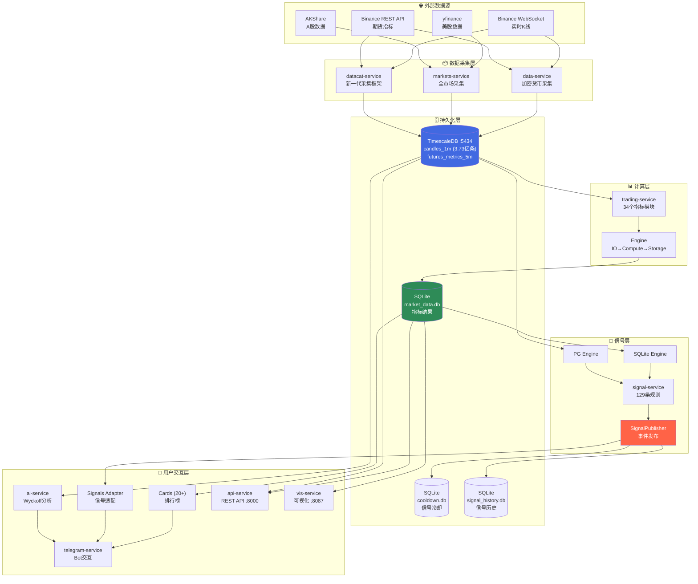
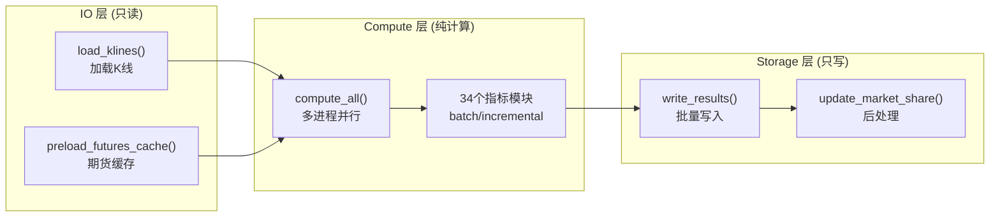
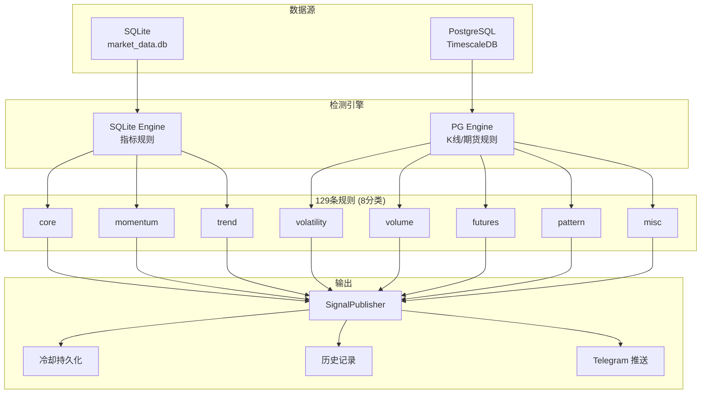

# TradeCat 项目整体架构分析报告

> 生成时间: 2026-01-29  
> 分析范围: 14个微服务、核心数据流、存储架构

---

## 1. 系统概览

TradeCat 是一个加密货币数据分析与交易辅助平台，采用微服务架构，核心功能包括：
- 多市场数据采集（加密货币、美股、A股、宏观经济）
- 34个技术指标计算
- 129条信号检测规则
- Telegram Bot 交互界面
- AI 智能分析（Wyckoff 方法论）

### 1.1 技术栈

| 层级 | 技术选型 |
|:---|:---|
| 语言 | Python 3.12, Node.js, Go |
| 数据库 | TimescaleDB (PostgreSQL 16), SQLite |
| 消息/事件 | SignalPublisher (内存事件总线) |
| API | FastAPI, python-telegram-bot |
| 数据处理 | pandas, numpy, TA-Lib |
| 外部数据 | CCXT, Cryptofeed, AKShare, yfinance |

---

## 2. 核心业务流程图

### 2.1 主数据流架构



### 2.2 指标计算流程（trading-service 内部）



### 2.3 信号检测流程（signal-service 内部）



---

## 3. 服务清单与职责边界

### 3.1 稳定版服务 (services/)

| 服务 | 入口 | 职责 | 数据依赖 | 数据输出 |
|:---|:---|:---|:---|:---|
| **data-service** | `src/__main__.py` | 币安数据采集（WS+REST）、历史回填 | Binance API | TimescaleDB |
| **trading-service** | `src/__main__.py` | 34个技术指标计算 | TimescaleDB | SQLite market_data.db |
| **telegram-service** | `src/main.py` | Bot交互、排行榜展示、信号推送UI | SQLite、SignalPublisher | Telegram |
| **ai-service** | `src/__main__.py` | Wyckoff AI分析（telegram子模块） | TimescaleDB、SQLite | Telegram |
| **signal-service** | `src/__main__.py` | 129条信号规则检测 | SQLite、TimescaleDB | SignalPublisher |
| **aws-service** | `src/db_sync_service.py` | SQLite本地→远端同步 | SQLite | AWS S3/RDS |

### 3.2 预览版服务 (services-preview/)

| 服务 | 入口 | 职责 | 状态 |
|:---|:---|:---|:---|
| **api-service** | `src/__main__.py` | REST API (CoinGlass V4 风格) :8000 | 开发中 |
| **markets-service** | `src/__main__.py` | 全市场采集（美股/A股/宏观） | 开发中 |
| **vis-service** | `src/__main__.py` | K线图/指标图可视化渲染 :8087 | 开发中 |
| **order-service** | `src/__main__.py` | Avellaneda-Stoikov 做市交易 | 预览 |
| **datacat-service** | `src/__main__.py` | 新一代数据采集框架（分层架构） | 开发中 |
| **predict-service** | Node.js | 预测市场信号（Polymarket等） | 预览 |
| **fate-service** | `services/telegram-service/` | 命理服务 :8001 | 预览 |
| **nofx-dev** | `main.go` | NOFX AI交易系统（Go语言） | 早期预览 |

---

## 4. 数据存储架构

### 4.1 TimescaleDB (端口 5433/5434)

| 表名 | 数据量 | 说明 |
|:---|:---|:---|
| `market_data.candles_1m` | 3.73亿条 (99GB) | 1分钟K线 |
| `market_data.binance_futures_metrics_5m` | 9457万条 (5GB) | 期货指标 |
| `market_data.*_last` | 物化视图 | 各周期最新数据 |

**端口说明**:
- 5433: 旧库（单schema，与早期脚本兼容）
- 5434: 新库（raw/agg/quality 多schema，.env.example 默认）

### 4.2 SQLite 数据库

| 路径 | 用途 | 写入者 | 读取者 |
|:---|:---|:---|:---|
| `libs/database/services/telegram-service/market_data.db` | 指标结果 | trading-service | telegram/ai/signal/api/vis |
| `libs/database/services/signal-service/cooldown.db` | 信号冷却状态 | signal-service | signal-service |
| `libs/database/services/signal-service/signal_history.db` | 信号触发历史 | signal-service | 分析脚本 |

---

## 5. 模块边界约束

根据 AGENTS.md 定义的边界规则：

| 服务 | 允许 | 禁止 |
|:---|:---|:---|
| data-service | 数据采集、存储到 TimescaleDB | 计算指标 |
| trading-service | 指标计算、写入 SQLite | 直接推送消息 |
| telegram-service | Bot交互、信号推送 UI | 包含信号检测逻辑 |
| signal-service | 信号检测、规则引擎 | Telegram依赖、写入业务数据库 |
| api-service | REST API数据查询 | 写入数据库 |
| vis-service | 可视化渲染 | 写入数据库 |

---

## 6. 关键技术决策

### 6.1 计算引擎分层 (trading-service)

采用 IO/Compute/Storage 三层分离架构：
- **IO层**: 只读，负责从 TimescaleDB 加载K线数据
- **Compute层**: 纯计算，多进程并行，不做数据库读写
- **Storage层**: 只写，批量写入 SQLite

### 6.2 信号检测双引擎 (signal-service)

- **SQLite Engine**: 读取指标结果表，适用于基于指标的规则
- **PG Engine**: 直接读取 TimescaleDB，适用于K线/期货原始数据规则

### 6.3 事件驱动通信

- 使用 `SignalPublisher` 内存事件总线
- 支持多订阅者（Telegram推送、历史持久化）
- 冷却机制防止重复推送

---

## 7. 附录

### 7.1 服务启动命令

```bash
# 核心服务一键启动
./scripts/start.sh start

# 单服务管理
cd services/<name> && make start|stop|status

# 守护进程模式
./scripts/start.sh daemon
```

### 7.2 数据流验证命令

```bash
# 检查 TimescaleDB
PGPASSWORD=postgres psql -h localhost -p 5434 -U postgres -d market_data \
  -c "SELECT COUNT(*) FROM market_data.candles_1m"

# 检查 SQLite
sqlite3 libs/database/services/telegram-service/market_data.db ".tables"
```
