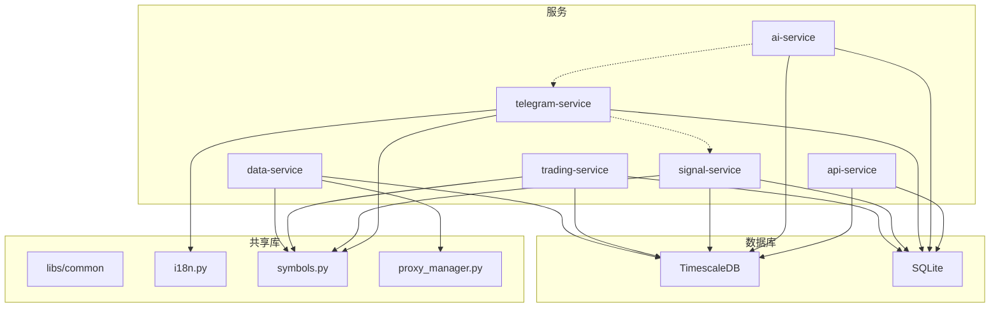

# TradeCat 核心模块健康度与冗余分析报告

> 生成时间: 2026-01-29  
> 分析方法: 静态代码分析 + 架构审查

---

## 1. 模块健康度总览

| 模块 | 健康度 | 主要问题 | 优先级 |
|:---|:---:|:---|:---:|
| data-service | 🟢 良好 | 无重大问题 | - |
| trading-service | 🟢 良好 | 已完成 IO/Compute/Storage 分层 | - |
| telegram-service | 🟡 一般 | 信号逻辑遗留、Cards 代码重复 | 中 |
| ai-service | 🟢 良好 | 作为子模块运行良好 | - |
| signal-service | 🟢 良好 | 新解耦，架构清晰 | - |
| api-service | 🟡 一般 | 路由冗余、缺少统一数据层 | 中 |
| datacat-service | 🟡 开发中 | 与 data-service 功能重叠 | 高 |
| markets-service | 🟡 开发中 | 缺少与主数据流集成 | 中 |

---

## 2. 问题详细分析

### 2.1 功能重叠与冗余

#### 问题 #1: data-service 与 datacat-service 功能重叠

**位置**:
- `services/data-service/src/collectors/`
- `services-preview/datacat-service/src/collectors/`

**现状**:
```
data-service/
├── collectors/
│   ├── ws.py          # WebSocket K线采集
│   ├── metrics.py     # 期货指标采集
│   └── backfill.py    # 历史回填

datacat-service/
├── collectors/
│   └── binance/um_futures/all/
│       ├── realtime/push/ws/klines/cryptofeed.py
│       ├── realtime/pull/rest/metrics/http.py
│       └── backfill/pull/...
```

**影响**:
- 两个服务都在采集相同的币安数据
- datacat-service 采用更清晰的分层结构，但尚未完全验证
- 维护两套采集逻辑增加技术债

**建议**:
- 短期：明确 datacat-service 为"预览/实验"版本
- 中期：datacat-service 稳定后逐步迁移，废弃 data-service
- 长期：统一采集层架构

---

#### 问题 #2: telegram-service 中的信号适配层冗余

**位置**:
- `services/telegram-service/src/signals/adapter.py`
- `services/telegram-service/src/signals/ui.py`

**现状**:
信号检测逻辑已迁移至 signal-service，但 telegram-service 中仍保留适配层代码。

```python
# adapter.py - 调用 signal-service
from signal_service import get_sqlite_engine
signals = engine.check_signals()
```

**评估**: 
这是合理的适配器模式，保留是正确的设计决策。标记为"已评估，无需改动"。

---

#### 问题 #3: Cards 模块代码重复

**位置**:
- `services/telegram-service/src/cards/basic/`
- `services/telegram-service/src/cards/advanced/`
- `services/telegram-service/src/cards/futures/`

**现状**:
20+ 张卡片存在大量重复模式：
- 数据加载逻辑重复
- 键盘构建逻辑重复
- 格式化逻辑重复

**示例**（每张卡片都有类似代码）:
```python
# KDJ排行卡片.py
provider = RankingDataProvider()
data = provider.get_ranking(table="KDJ随机指标扫描器.py", ...)
# 构建键盘...
# 格式化消息...

# RSI谐波排行卡片.py
provider = RankingDataProvider()
data = provider.get_ranking(table="谐波信号扫描器.py", ...)
# 构建键盘...（几乎相同）
# 格式化消息...（几乎相同）
```

**影响**:
- 新增卡片需要大量复制粘贴
- 修改通用逻辑需要改动多个文件
- 容易产生不一致

**建议**:
- 提取 `BaseRankingCard` 抽象基类
- 使用配置驱动而非代码驱动
- 参考 `registry.py` 的注册模式统一管理

---

### 2.2 职责边界模糊

#### 问题 #4: api-service 路由缺少统一数据层

**位置**:
- `services-preview/api-service/src/routers/`

**现状**:
```
routers/
├── ohlc.py              # 直接查询 TimescaleDB
├── open_interest.py     # 直接查询 TimescaleDB
├── funding_rate.py      # 直接查询 TimescaleDB
├── futures_metrics.py   # 直接查询 TimescaleDB
├── base_data.py         # 直接查询 SQLite
├── indicator.py         # 直接查询 SQLite
└── signal.py            # 调用 signal-service
```

**问题**:
- 每个路由模块都有独立的数据库连接逻辑
- 没有统一的 Repository/DAO 层
- 缓存策略分散

**建议**:
- 创建 `services-preview/api-service/src/repositories/` 统一数据访问
- 引入连接池和查询缓存
- 参考 trading-service 的 `db/reader.py` 模式

---

#### 问题 #5: 配置管理分散

**位置**:
- `services/*/src/config.py` (多个)
- `config/.env` (全局)
- `config/.env.example` (模板)

**现状**:
每个服务都有自己的 `config.py`，但配置来源和解析逻辑不一致：

```python
# data-service/src/config.py
database_url = os.getenv("DATABASE_URL", "...")

# trading-service/src/config.py  
db_url = os.getenv("DATABASE_URL", "...")

# signal-service/src/config.py
def get_database_url():
    url = os.environ.get("DATABASE_URL")
    if url:
        return url
    # 还会读取 config/.env 文件...
```

**问题**:
- 配置键名不一致（`database_url` vs `db_url`）
- 配置加载逻辑重复
- 默认值分散在各处

**建议**:
- 创建 `libs/common/config.py` 统一配置管理
- 使用 pydantic-settings 或类似库
- 所有服务继承/导入统一配置

---

### 2.3 设计缺陷

#### 问题 #6: 端口配置混乱（5433 vs 5434）

**位置**:
- `config/.env.example` (默认 5434)
- `scripts/export_timescaledb.sh` (默认 5433)
- `scripts/timescaledb_compression.sh` (默认 5433)
- 各服务 README.md (混用)

**影响**:
- 新用户容易配错端口
- 数据可能写入错误的数据库
- 脚本与服务指向不同端口导致数据分叉

**建议**:
- 统一选定端口（建议 5434 新库）
- 一次性更新所有脚本和文档
- 在 `scripts/check_env.sh` 中增加端口一致性检查

---

#### 问题 #7: 日志格式不一致

**位置**: 各服务的 logging 配置

**现状**:
```python
# data-service
logging.basicConfig(level=logging.INFO, format="%(asctime)s - %(levelname)s - %(message)s")

# trading-service (observability 模块)
setup_logging(level=args.log_level, log_file=args.log_file, json_format=args.json_log)

# signal-service
logging.basicConfig(level=logging.INFO, format="%(asctime)s - %(levelname)s - %(name)s - %(message)s")
```

**问题**:
- 日志格式不统一，难以聚合分析
- 部分服务支持 JSON 日志，部分不支持
- 缺少统一的 trace_id 支持

**建议**:
- 在 `libs/common/` 创建统一日志配置
- 采用 JSON Lines 格式便于 ELK/Loki 分析
- 增加 correlation_id 支持

---

### 2.4 技术债标记

| ID | 位置 | 描述 | 严重度 |
|:---|:---|:---|:---:|
| TD-001 | datacat-service | 与 data-service 功能重叠，需明确替代计划 | 高 |
| TD-002 | telegram-service/cards | 20+ 卡片代码重复，需抽象基类 | 中 |
| TD-003 | api-service/routers | 缺少统一数据访问层 | 中 |
| TD-004 | */config.py | 配置管理分散，键名不一致 | 中 |
| TD-005 | scripts/*.sh | 端口硬编码 5433，与 .env.example 不一致 | 高 |
| TD-006 | */logging | 日志格式不统一 | 低 |
| TD-007 | AGENTS.md | 存在重复段落（7.8 端口冲突写了两遍） | 低 |

---

## 3. 模块依赖图



---

## 4. 总结

### 4.1 优点

1. **微服务边界清晰**: 核心服务（data/trading/signal/telegram）职责分明
2. **计算引擎架构良好**: trading-service 的 IO/Compute/Storage 分层设计优秀
3. **信号服务解耦完成**: signal-service 独立运行，规则引擎可扩展
4. **文档齐全**: AGENTS.md 提供了详细的操作指南

### 4.2 需要改进

1. **数据采集层统一**: data-service 和 datacat-service 需要整合
2. **代码复用**: telegram-service/cards 需要抽象
3. **配置管理**: 需要统一配置层
4. **端口标准化**: 统一 TimescaleDB 端口
