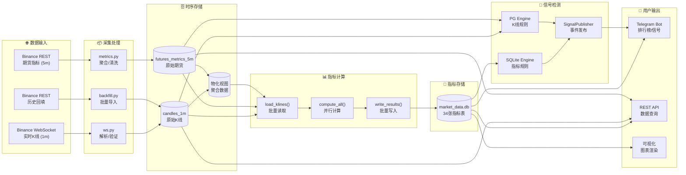
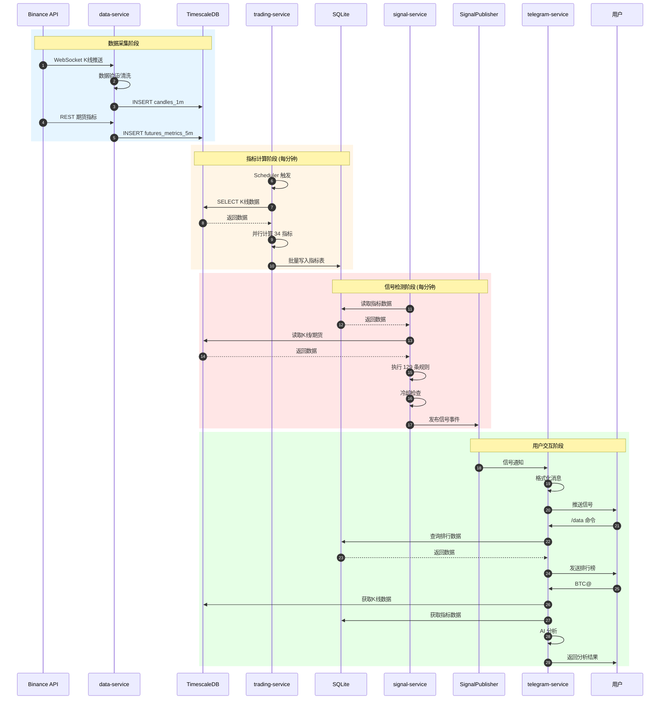
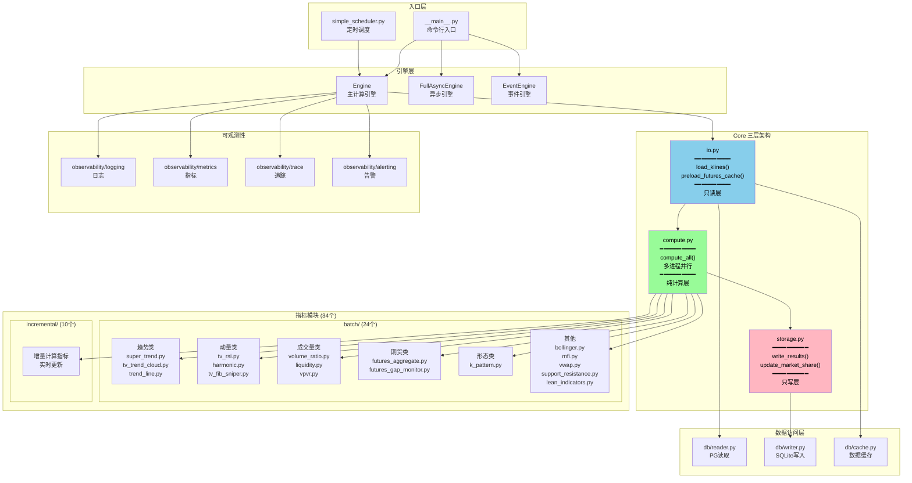
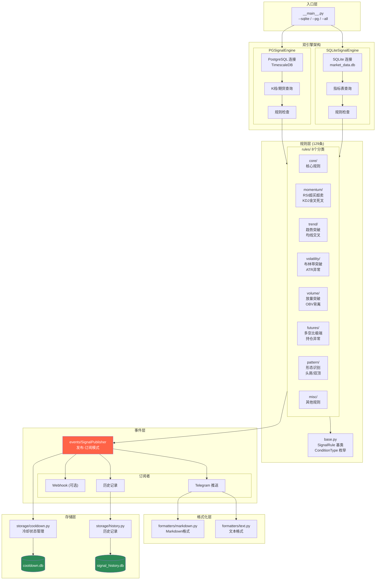

# TradeCat 完整系统架构流程图

> 生成时间: 2026-01-29  
> 版本: v1.0 - 全系统完整版

---

## 1. 系统全景架构图

```mermaid
graph TB
    %% ==================== 外部数据源层 ====================
    subgraph EXTERNAL["🌐 外部数据源"]
        direction LR
        BINANCE_WS["Binance WebSocket<br>实时K线推送"]
        BINANCE_REST["Binance REST API<br>期货指标/历史数据"]
        YFINANCE["yfinance<br>美股行情"]
        AKSHARE["AKShare<br>A股行情"]
        FRED["FRED API<br>宏观经济数据"]
        POLYMARKET["Polymarket API<br>预测市场"]
    end

    %% ==================== 数据采集层 ====================
    subgraph COLLECT["📦 数据采集层"]
        direction TB
        
        subgraph DS["data-service (稳定版)"]
            DS_WS["ws.py<br>WebSocket K线采集"]
            DS_METRICS["metrics.py<br>期货指标采集"]
            DS_BACKFILL["backfill.py<br>历史数据回填"]
            DS_ALPHA["alpha.py<br>Alpha列表同步"]
        end
        
        subgraph DC["datacat-service (预览版)"]
            DC_WS["cryptofeed.py<br>实时K线"]
            DC_METRICS["http.py<br>期货指标"]
            DC_BACKFILL["http_zip.py<br>压缩包回填"]
        end
        
        subgraph MS["markets-service (预览版)"]
            MS_STOCK["美股/A股采集"]
            MS_MACRO["宏观数据采集"]
        end
        
        subgraph PS["predict-service (预览版)"]
            PS_POLY["Polymarket 监控"]
            PS_KALSHI["Kalshi 监控"]
        end
    end

    %% ==================== 持久化层 ====================
    subgraph STORAGE["🗄️ 持久化层"]
        direction TB
        
        subgraph TSDB["TimescaleDB :5434"]
            TSDB_CANDLES[("candles_1m<br>3.73亿条 K线")]
            TSDB_FUTURES[("futures_metrics_5m<br>9457万条 期货指标")]
            TSDB_VIEWS[("物化视图<br>*_5m_last, *_1h_last...")]
        end
        
        subgraph SQLITE["SQLite 数据库集群"]
            SQLITE_MARKET[("market_data.db<br>34张指标表")]
            SQLITE_COOLDOWN[("cooldown.db<br>信号冷却状态")]
            SQLITE_HISTORY[("signal_history.db<br>信号触发历史")]
        end
    end

    %% ==================== 计算层 ====================
    subgraph COMPUTE["📊 计算层"]
        direction TB
        
        subgraph TS["trading-service"]
            TS_ENGINE["Engine 引擎<br>IO→Compute→Storage"]
            TS_SCHEDULER["simple_scheduler.py<br>定时调度器"]
            
            subgraph TS_IND["34个指标模块"]
                IND_TREND["趋势指标<br>EMA/MACD/SuperTrend<br>ADX/Ichimoku/趋势云"]
                IND_MOMENTUM["动量指标<br>RSI/KDJ/MFI<br>CCI/WilliamsR"]
                IND_VOLATILITY["波动指标<br>布林带/ATR<br>支撑阻力/VWAP"]
                IND_VOLUME["成交量指标<br>OBV/CVD/VPVR<br>流动性/量比"]
                IND_PATTERN["形态识别<br>61种K线形态<br>价格形态检测"]
                IND_FUTURES["期货指标<br>持仓量/多空比<br>资金费率/爆仓"]
            end
        end
        
        subgraph TS_CORE["Core 分层架构"]
            CORE_IO["io.py<br>数据读取 (只读)"]
            CORE_COMPUTE["compute.py<br>并行计算 (纯计算)"]
            CORE_STORAGE["storage.py<br>结果落盘 (只写)"]
        end
    end

    %% ==================== 信号检测层 ====================
    subgraph SIGNAL["🔔 信号检测层"]
        direction TB
        
        subgraph SIG["signal-service"]
            SIG_MAIN["__main__.py<br>服务入口"]
            
            subgraph SIG_ENGINE["双引擎架构"]
                SIG_SQLITE_ENG["SQLiteSignalEngine<br>读取指标表"]
                SIG_PG_ENG["PGSignalEngine<br>读取K线/期货"]
            end
            
            subgraph SIG_RULES["129条信号规则 (8分类)"]
                RULE_CORE["core 核心规则"]
                RULE_MOMENTUM["momentum 动量"]
                RULE_TREND["trend 趋势"]
                RULE_VOLATILITY["volatility 波动"]
                RULE_VOLUME["volume 成交量"]
                RULE_FUTURES["futures 期货"]
                RULE_PATTERN["pattern 形态"]
                RULE_MISC["misc 杂项"]
            end
            
            SIG_PUBLISHER["SignalPublisher<br>事件发布总线"]
            SIG_COOLDOWN["cooldown.py<br>冷却管理"]
            SIG_FORMATTER["formatters/<br>信号格式化"]
        end
    end

    %% ==================== AI分析层 ====================
    subgraph AI_LAYER["🧠 AI 分析层"]
        direction TB
        
        subgraph AI["ai-service"]
            AI_FETCHER["data/fetcher.py<br>数据获取"]
            AI_PROMPT["prompt/<br>提示词管理"]
            AI_LLM["llm/<br>多模型客户端"]
            
            subgraph AI_MODELS["支持的 LLM"]
                LLM_GEMINI["Google Gemini"]
                LLM_OPENAI["OpenAI GPT"]
                LLM_CLAUDE["Anthropic Claude"]
                LLM_DEEPSEEK["DeepSeek"]
            end
            
            AI_WYCKOFF["Wyckoff 方法论<br>市场结构分析"]
        end
    end

    %% ==================== 用户交互层 ====================
    subgraph USER_LAYER["👤 用户交互层"]
        direction TB
        
        subgraph TG["telegram-service"]
            TG_BOT["bot/app.py<br>Bot 主程序"]
            TG_HANDLERS["handlers/<br>命令处理"]
            
            subgraph TG_CARDS["39张排行榜卡片"]
                CARDS_BASIC["基础卡片 (10张)<br>RSI/KDJ/MACD/布林带<br>OBV/支撑阻力/成交量..."]
                CARDS_ADVANCED["高级卡片 (11张)<br>EMA/ATR/CVD/MFI<br>VWAP/K线形态/趋势线..."]
                CARDS_FUTURES["期货卡片 (18张)<br>持仓量/多空比/资金费率<br>爆仓/OI异常/情绪聚合..."]
            end
            
            TG_ADAPTER["signals/adapter.py<br>信号服务适配器"]
            TG_PROVIDER["data_provider.py<br>数据提供者"]
            TG_I18N["i18n.py<br>国际化 (中/英)"]
            TG_SNAPSHOT["single_token_snapshot.py<br>单币详情"]
        end
        
        subgraph API["api-service (预览版)"]
            API_APP["app.py<br>FastAPI 入口"]
            
            subgraph API_ROUTERS["API 路由"]
                ROUTER_OHLC["ohlc.py<br>K线数据"]
                ROUTER_OI["open_interest.py<br>持仓量"]
                ROUTER_FUNDING["funding_rate.py<br>资金费率"]
                ROUTER_METRICS["futures_metrics.py<br>期货指标"]
                ROUTER_INDICATOR["indicator.py<br>技术指标"]
                ROUTER_SIGNAL["signal.py<br>信号查询"]
                ROUTER_BASE["base_data.py<br>基础数据"]
            end
        end
        
        subgraph VIS["vis-service (预览版)"]
            VIS_APP["app.py<br>FastAPI 入口"]
            VIS_CHART["K线图渲染"]
            VIS_INDICATOR["指标图渲染"]
            VIS_VPVR["VPVR 渲染"]
        end
    end

    %% ==================== 交易执行层 ====================
    subgraph TRADE_LAYER["💹 交易执行层"]
        direction TB
        
        subgraph ORD["order-service (预览版)"]
            ORD_MM["market-maker/<br>Avellaneda-Stoikov 做市"]
            ORD_EXEC["交易执行引擎"]
        end
        
        subgraph AWS["aws-service"]
            AWS_SYNC["db_sync_service.py<br>SQLite 远端同步"]
        end
    end

    %% ==================== 运维支撑层 ====================
    subgraph OPS["⚙️ 运维支撑层"]
        direction TB
        
        subgraph SCRIPTS["全局脚本"]
            SCR_START["start.sh<br>服务启动/守护"]
            SCR_INIT["init.sh<br>环境初始化"]
            SCR_VERIFY["verify.sh<br>代码验证"]
            SCR_CHECK["check_env.sh<br>环境检查"]
            SCR_EXPORT["export_timescaledb.sh<br>数据导出"]
        end
        
        subgraph LIBS["共享库 libs/common"]
            LIB_I18N["i18n.py<br>国际化"]
            LIB_SYMBOLS["symbols.py<br>币种管理"]
            LIB_PROXY["proxy_manager.py<br>代理管理"]
        end
        
        subgraph CONFIG["配置管理"]
            CFG_ENV["config/.env<br>生产配置"]
            CFG_EXAMPLE["config/.env.example<br>配置模板"]
        end
    end

    %% ==================== 最终用户 ====================
    USER["👤 Telegram 用户<br>查询/订阅/分析"]

    %% ==================== 连接关系 ====================
    
    %% 数据源 → 采集层
    BINANCE_WS --> DS_WS
    BINANCE_WS --> DC_WS
    BINANCE_REST --> DS_METRICS
    BINANCE_REST --> DS_BACKFILL
    BINANCE_REST --> DC_METRICS
    BINANCE_REST --> DC_BACKFILL
    YFINANCE --> MS_STOCK
    AKSHARE --> MS_STOCK
    FRED --> MS_MACRO
    POLYMARKET --> PS_POLY

    %% 采集层 → 持久化层
    DS_WS --> TSDB_CANDLES
    DS_METRICS --> TSDB_FUTURES
    DS_BACKFILL --> TSDB_CANDLES
    DC_WS --> TSDB_CANDLES
    DC_METRICS --> TSDB_FUTURES
    MS_STOCK --> TSDB_CANDLES
    MS_MACRO --> TSDB_CANDLES

    %% 持久化层 → 计算层
    TSDB_CANDLES --> CORE_IO
    TSDB_FUTURES --> CORE_IO
    TSDB_VIEWS --> CORE_IO

    %% 计算层内部
    TS_SCHEDULER --> TS_ENGINE
    TS_ENGINE --> CORE_IO
    CORE_IO --> CORE_COMPUTE
    CORE_COMPUTE --> TS_IND
    TS_IND --> CORE_STORAGE
    CORE_STORAGE --> SQLITE_MARKET

    %% 持久化层 → 信号层
    SQLITE_MARKET --> SIG_SQLITE_ENG
    TSDB_CANDLES --> SIG_PG_ENG
    TSDB_FUTURES --> SIG_PG_ENG

    %% 信号层内部
    SIG_MAIN --> SIG_ENGINE
    SIG_SQLITE_ENG --> SIG_RULES
    SIG_PG_ENG --> SIG_RULES
    SIG_RULES --> SIG_PUBLISHER
    SIG_PUBLISHER --> SIG_COOLDOWN
    SIG_COOLDOWN --> SQLITE_COOLDOWN
    SIG_PUBLISHER --> SQLITE_HISTORY
    SIG_PUBLISHER --> SIG_FORMATTER

    %% AI层
    TSDB_CANDLES --> AI_FETCHER
    SQLITE_MARKET --> AI_FETCHER
    AI_FETCHER --> AI_PROMPT
    AI_PROMPT --> AI_LLM
    AI_LLM --> AI_WYCKOFF

    %% 用户交互层
    SQLITE_MARKET --> TG_PROVIDER
    TG_PROVIDER --> TG_CARDS
    TG_CARDS --> TG_BOT
    SIG_FORMATTER --> TG_ADAPTER
    TG_ADAPTER --> TG_BOT
    AI_WYCKOFF --> TG_BOT
    TG_BOT --> USER

    %% API 层
    SQLITE_MARKET --> API_ROUTERS
    TSDB_CANDLES --> API_ROUTERS
    TSDB_FUTURES --> API_ROUTERS
    API_ROUTERS --> API_APP

    %% 可视化层
    SQLITE_MARKET --> VIS_APP
    TSDB_CANDLES --> VIS_APP

    %% 交易执行层
    TSDB_CANDLES --> ORD_MM
    TSDB_FUTURES --> ORD_MM
    SQLITE_MARKET --> AWS_SYNC

    %% 运维层
    CFG_ENV --> DS
    CFG_ENV --> TS
    CFG_ENV --> SIG
    CFG_ENV --> TG
    CFG_ENV --> AI
    LIB_SYMBOLS --> DS
    LIB_SYMBOLS --> TS
    LIB_SYMBOLS --> SIG
    LIB_I18N --> TG

    %% 样式
    style TSDB_CANDLES fill:#4169E1,color:#fff
    style TSDB_FUTURES fill:#4169E1,color:#fff
    style SQLITE_MARKET fill:#2E8B57,color:#fff
    style SIG_PUBLISHER fill:#FF6347,color:#fff
    style USER fill:#FFD700,color:#000
```

---

## 2. 数据流详细图

---

## 3. 服务交互时序图

---

## 4. trading-service 内部架构图

---

## 5. signal-service 内部架构图

---

## 6. telegram-service 内部架构图

```mermaid
graph TD
    subgraph 入口["入口层"]
        MAIN["main.py / bot/app.py<br>Application 初始化"]
    end

    subgraph Bot核心["Bot 核心"]
        BOT["Bot 实例<br>python-telegram-bot"]
        
        subgraph 处理器["handlers/"]
            H_CMD["命令处理<br>/data /ai /query /help"]
            H_CALLBACK["回调处理<br>按钮点击"]
            H_MESSAGE["消息处理<br>BTC! BTC!! BTC@"]
        end
    end

    subgraph 卡片系统["卡片系统 cards/"]
        REGISTRY["registry.py<br>卡片注册表"]
        PROVIDER["data_provider.py<br>数据提供者"]
        I18N["i18n.py<br>国际化"]
        
        subgraph 基础卡片["basic/ (10张)"]
            C_RSI["RSI排行"]
            C_KDJ["KDJ排行"]
            C_MACD["MACD排行"]
            C_BB["布林带排行"]
            C_OBV["OBV排行"]
            C_SR["支撑阻力排行"]
            C_VOL["成交量排行"]
            C_FUNDING["资金费率排行"]
            C_OTHER_B["..."]
        end
        
        subgraph 高级卡片["advanced/ (11张)"]
            C_EMA["EMA排行"]
            C_ATR["ATR排行"]
            C_CVD["CVD排行"]
            C_MFI["MFI排行"]
            C_VWAP["VWAP排行"]
            C_PATTERN["K线形态排行"]
            C_TREND["趋势线排行"]
            C_SUPER["超级趋势排行"]
            C_LIQUIDITY["流动性排行"]
            C_VPVR["VPVR排行"]
            C_OTHER_A["..."]
        end
        
        subgraph 期货卡片["futures/ (18张)"]
            C_OI["持仓量排行"]
            C_RATIO["多空比排行"]
            C_TAKER["主动买卖比排行"]
            C_LIQ["爆仓排行"]
            C_SENTIMENT["情绪聚合"]
            C_DEPTH["市场深度"]
            C_OTHER_F["..."]
        end
    end

    subgraph 信号适配["信号适配 signals/"]
        ADAPTER["adapter.py<br>signal-service 适配"]
        UI["ui.py<br>信号展示"]
    end

    subgraph 单币查询["单币详情"]
        SNAPSHOT["single_token_snapshot.py<br>多面板展示"]
        EXPORT["TXT 导出"]
    end

    subgraph AI分析["AI 分析集成"]
        AI_HANDLER["AI 命令处理"]
        AI_SERVICE["ai-service 调用"]
    end

    subgraph 数据源["数据源"]
        SQLITE[("market_data.db")]
        SIG_PUB["SignalPublisher"]
    end

    %% 连接
    MAIN --> BOT
    BOT --> H_CMD
    BOT --> H_CALLBACK
    BOT --> H_MESSAGE

    H_CMD --> REGISTRY
    H_CALLBACK --> REGISTRY
    H_MESSAGE --> SNAPSHOT
    H_MESSAGE --> AI_HANDLER

    REGISTRY --> PROVIDER
    PROVIDER --> SQLITE
    PROVIDER --> I18N

    REGISTRY --> C_RSI
    REGISTRY --> C_KDJ
    REGISTRY --> C_EMA
    REGISTRY --> C_OI

    ADAPTER --> SIG_PUB
    ADAPTER --> UI
    UI --> BOT

    SNAPSHOT --> SQLITE
    EXPORT --> SQLITE

    AI_HANDLER --> AI_SERVICE

    style SQLITE fill:#2E8B57,color:#fff
    style SIG_PUB fill:#FF6347,color:#fff
```

---

## 7. 配置与运维架构图

```mermaid
graph TD
    subgraph 配置管理["配置管理"]
        ENV["config/.env<br>生产配置 (敏感)"]
        ENV_EXAMPLE["config/.env.example<br>配置模板"]
        
        subgraph 配置项["主要配置项"]
            CFG_DB["DATABASE_URL<br>TimescaleDB :5434"]
            CFG_BOT["BOT_TOKEN<br>Telegram Bot"]
            CFG_PROXY["HTTP_PROXY<br>网络代理"]
            CFG_SYMBOLS["SYMBOLS_GROUPS<br>币种分组"]
            CFG_WORKERS["MAX_WORKERS<br>并行数"]
            CFG_BACKEND["COMPUTE_BACKEND<br>计算后端"]
            CFG_COOLDOWN["COOLDOWN_SECONDS<br>信号冷却"]
        end
    end

    subgraph 全局脚本["全局脚本 scripts/"]
        SCR_INIT["init.sh<br>━━━━━━━━━━<br>创建 .venv<br>安装依赖<br>复制配置"]
        SCR_START["start.sh<br>━━━━━━━━━━<br>start/stop/status<br>daemon 模式<br>自动重启"]
        SCR_VERIFY["verify.sh<br>━━━━━━━━━━<br>ruff 检查<br>py_compile<br>i18n 检查"]
        SCR_CHECK["check_env.sh<br>━━━━━━━━━━<br>Python 版本<br>依赖完整性<br>数据库连接<br>网络连通"]
        SCR_EXPORT["export_timescaledb.sh<br>━━━━━━━━━━<br>数据备份<br>zstd 压缩"]
    end

    subgraph 服务Makefile["服务级 Makefile"]
        MAKE_VENV["make venv<br>创建虚拟环境"]
        MAKE_INSTALL["make install<br>安装依赖"]
        MAKE_LINT["make lint<br>ruff 检查"]
        MAKE_TEST["make test<br>pytest 测试"]
        MAKE_START["make start<br>启动服务"]
        MAKE_STOP["make stop<br>停止服务"]
    end

    subgraph 共享库["共享库 libs/common/"]
        LIB_I18N["i18n.py<br>━━━━━━━━━━<br>多语言支持<br>zh-CN / en"]
        LIB_SYMBOLS["symbols.py<br>━━━━━━━━━━<br>币种分组管理<br>main4/main6/all"]
        LIB_PROXY["proxy_manager.py<br>━━━━━━━━━━<br>代理配置<br>自动切换"]
    end

    subgraph 日志系统["日志系统"]
        LOG_DAEMON["logs/daemon.log<br>守护进程日志"]
        LOG_SERVICE["services/*/logs/<br>服务日志"]
        LOGROTATE["config/logrotate.conf<br>日志轮转"]
    end

    subgraph 进程管理["进程管理"]
        PID_DAEMON["run/daemon.pid"]
        PID_SERVICE["services/*/run/*.pid"]
    end

    %% 连接
    ENV --> CFG_DB
    ENV --> CFG_BOT
    ENV --> CFG_PROXY
    ENV --> CFG_SYMBOLS
    ENV --> CFG_WORKERS
    ENV --> CFG_BACKEND
    ENV --> CFG_COOLDOWN

    ENV_EXAMPLE -.-> ENV

    SCR_INIT --> ENV
    SCR_START --> PID_DAEMON
    SCR_START --> PID_SERVICE
    SCR_START --> LOG_DAEMON

    MAKE_START --> LOG_SERVICE
    MAKE_START --> PID_SERVICE

    LOGROTATE --> LOG_DAEMON
    LOGROTATE --> LOG_SERVICE

    style ENV fill:#FFD700,color:#000
    style ENV_EXAMPLE fill:#FFFACD,color:#000
```

---

## 8. 数据库 Schema 架构图

```mermaid
graph TD
    subgraph TimescaleDB["TimescaleDB :5434"]
        subgraph market_data_schema["Schema: market_data"]
            T_CANDLES["candles_1m<br>━━━━━━━━━━<br>symbol VARCHAR<br>bucket_ts TIMESTAMPTZ<br>open, high, low, close DECIMAL<br>volume, quote_volume DECIMAL<br>taker_buy_volume DECIMAL<br>━━━━━━━━━━<br>超表 (Hypertable)<br>按 bucket_ts 分区"]
            
            T_FUTURES["binance_futures_metrics_5m<br>━━━━━━━━━━<br>symbol VARCHAR<br>create_time TIMESTAMPTZ<br>sum_open_interest DECIMAL<br>sum_open_interest_value DECIMAL<br>sum_toptrader_long_short_ratio DECIMAL<br>sum_taker_long_short_vol_ratio DECIMAL<br>━━━━━━━━━━<br>超表 (Hypertable)"]
            
            subgraph 物化视图["物化视图 (Continuous Aggregates)"]
                MV_5M["candles_5m_last"]
                MV_15M["candles_15m_last"]
                MV_1H["candles_1h_last"]
                MV_4H["candles_4h_last"]
                MV_1D["candles_1d_last"]
                MV_1W["candles_1w_last"]
                MV_F_15M["futures_metrics_15m_last"]
                MV_F_1H["futures_metrics_1h_last"]
            end
        end
    end

    subgraph SQLite集群["SQLite 数据库集群"]
        subgraph MARKET_DB["market_data.db (34张表)"]
            subgraph 趋势指标表["趋势指标"]
                TBL_EMA["G，C点扫描器.py<br>EMA7/25/99"]
                TBL_SUPER["超级精准趋势扫描器.py"]
                TBL_TREND["趋势线榜单.py"]
            end
            
            subgraph 动量指标表["动量指标"]
                TBL_RSI["RSI相对强弱扫描器.py"]
                TBL_KDJ["KDJ随机指标扫描器.py"]
                TBL_MACD["MACD柱状扫描器.py"]
                TBL_MFI["MFI资金流量扫描器.py"]
                TBL_HARMONIC["谐波信号扫描器.py"]
            end
            
            subgraph 波动指标表["波动指标"]
                TBL_BB["布林带扫描器.py"]
                TBL_ATR["ATR波幅扫描器.py"]
                TBL_SR["全量支撑阻力扫描器.py"]
                TBL_VWAP["VWAP离线信号扫描.py"]
            end
            
            subgraph 成交量指标表["成交量指标"]
                TBL_OBV["OBV能量潮扫描器.py"]
                TBL_CVD["CVD信号排行榜.py"]
                TBL_VOL["成交量比率扫描器.py"]
                TBL_VPVR["VPVR成交量分布.py"]
                TBL_LIQ["流动性扫描器.py"]
            end
            
            subgraph 形态指标表["形态指标"]
                TBL_KPAT["K线形态扫描器.py"]
            end
            
            subgraph 期货指标表["期货指标"]
                TBL_SENTIMENT["期货情绪聚合表.py"]
                TBL_FMETA["期货情绪元数据.py"]
                TBL_TAKER["主动买卖比扫描器.py"]
            end
        end
        
        subgraph COOLDOWN_DB["cooldown.db"]
            TBL_CD["cooldown<br>━━━━━━━━━━<br>key TEXT PRIMARY KEY<br>expire_at REAL"]
        end
        
        subgraph HISTORY_DB["signal_history.db"]
            TBL_HIST["signal_history<br>━━━━━━━━━━<br>id INTEGER PRIMARY KEY<br>timestamp TEXT<br>rule_id TEXT<br>symbol TEXT<br>interval TEXT<br>value REAL<br>source TEXT"]
        end
    end

    %% 数据流向
    T_CANDLES --> MV_5M
    T_CANDLES --> MV_15M
    T_CANDLES --> MV_1H
    T_CANDLES --> MV_4H
    T_CANDLES --> MV_1D
    T_CANDLES --> MV_1W

    T_FUTURES --> MV_F_15M
    T_FUTURES --> MV_F_1H

    T_CANDLES -.->|trading-service| TBL_EMA
    T_FUTURES -.->|trading-service| TBL_SENTIMENT

    style T_CANDLES fill:#4169E1,color:#fff
    style T_FUTURES fill:#4169E1,color:#fff
    style MARKET_DB fill:#2E8B57,color:#fff
    style COOLDOWN_DB fill:#2E8B57,color:#fff
    style HISTORY_DB fill:#2E8B57,color:#fff
```

---

## 9. 完整系统状态机

```mermaid
stateDiagram-v2
    [*] --> 系统初始化
    
    state 系统初始化 {
        [*] --> 运行init.sh
        运行init.sh --> 创建虚拟环境
        创建虚拟环境 --> 安装依赖
        安装依赖 --> 复制配置
        复制配置 --> 配置.env
        配置.env --> [*]
    }
    
    系统初始化 --> 服务启动
    
    state 服务启动 {
        [*] --> 启动data_service
        启动data_service --> 启动trading_service
        启动trading_service --> 启动signal_service
        启动signal_service --> 启动telegram_service
        telegram_service --> [*]
    }
    
    服务启动 --> 正常运行
    
    state 正常运行 {
        state 数据采集 {
            WebSocket监听 --> 实时K线写入
            REST轮询 --> 期货指标写入
            实时K线写入 --> WebSocket监听
            期货指标写入 --> REST轮询
        }
        
        state 指标计算 {
            定时触发 --> 读取K线
            读取K线 --> 并行计算
            并行计算 --> 写入SQLite
            写入SQLite --> 定时触发
        }
        
        state 信号检测 {
            轮询触发 --> 读取指标
            读取指标 --> 规则匹配
            规则匹配 --> 冷却检查
            冷却检查 --> 发布信号: 通过
            冷却检查 --> 轮询触发: 冷却中
            发布信号 --> 轮询触发
        }
        
        state 用户交互 {
            等待命令 --> 处理查询: 收到命令
            处理查询 --> 返回结果
            返回结果 --> 等待命令
            等待命令 --> 推送信号: 收到信号
            推送信号 --> 等待命令
        }
        
        数据采集 --> 指标计算: K线数据
        指标计算 --> 信号检测: 指标数据
        信号检测 --> 用户交互: 信号事件
    }
    
    正常运行 --> 异常处理: 服务崩溃
    
    state 异常处理 {
        检测崩溃 --> 重试计数
        重试计数 --> 自动重启: 未超限
        重试计数 --> 告警通知: 超过5次
        自动重启 --> 指数退避
        指数退避 --> 服务恢复
    }
    
    异常处理 --> 正常运行: 恢复成功
    异常处理 --> 人工介入: 恢复失败
    
    正常运行 --> 优雅停止: SIGTERM
    
    state 优雅停止 {
        停止接收请求 --> 等待处理完成
        等待处理完成 --> 关闭连接
        关闭连接 --> 清理资源
    }
    
    优雅停止 --> [*]
    人工介入 --> [*]
```

---

## 10. 附录：系统统计

| 维度 | 数量 | 详情 |
|:---|:---:|:---|
| 微服务总数 | 14 | 稳定版 6 + 预览版 8 |
| 技术指标 | 34 | batch 24 + incremental 10 |
| 信号规则 | 129 | 8 个分类 |
| 排行榜卡片 | 39 | basic 10 + advanced 11 + futures 18 |
| API 路由 | 9 | CoinGlass V4 风格 |
| K线数据量 | 3.73亿条 | 2018年至今 |
| 期货数据量 | 9457万条 | 2021年至今 |
| 支持 LLM | 4 | Gemini/OpenAI/Claude/DeepSeek |
| 支持语言 | 2 | 中文/英文 |
